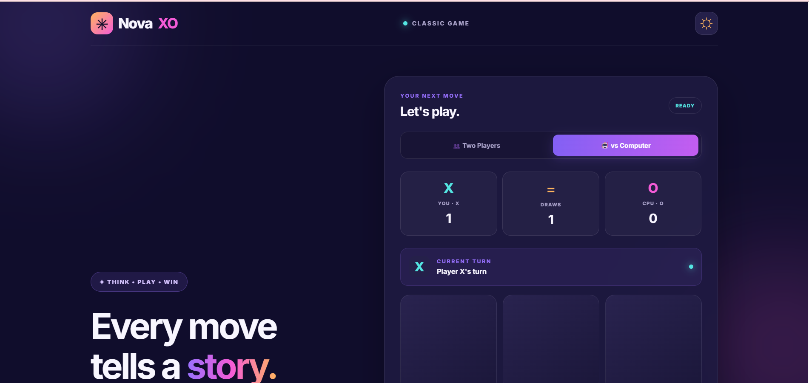

# NovaXO - Tic-Tac-Toe Web Application

An interactive and responsive Tic-Tac-Toe game developed as part of the Prodigy InfoTech Web Development Internship, Task 03.

## Features

- Two-player game mode
- Play against a computer opponent
- Computer AI using the Minimax algorithm
- Automatic winner and draw detection
- Score tracking for both players
- New Game and Reset Scores controls
- Dark and light themes
- Responsive design for mobile and desktop
- Animated game board and winning cells

## Technologies Used

- HTML5
- CSS3
- JavaScript
- 
## Screenshots

### Home Page

### Computer Mode

### Winning Result

## Project Structure

- index.html - Game structure
- style.css - Styling and responsive layout
- script.js - Game logic and computer AI

## How to Run

1. Download or clone this repository.
2. Open index.html in a web browser.
3. Select Two Players or vs Computer.
4. Start playing.

## Internship

Prodigy InfoTech Web Development Internship

Task 03: Tic-Tac-Toe Web Application

## Developer

Kaushal Patil
